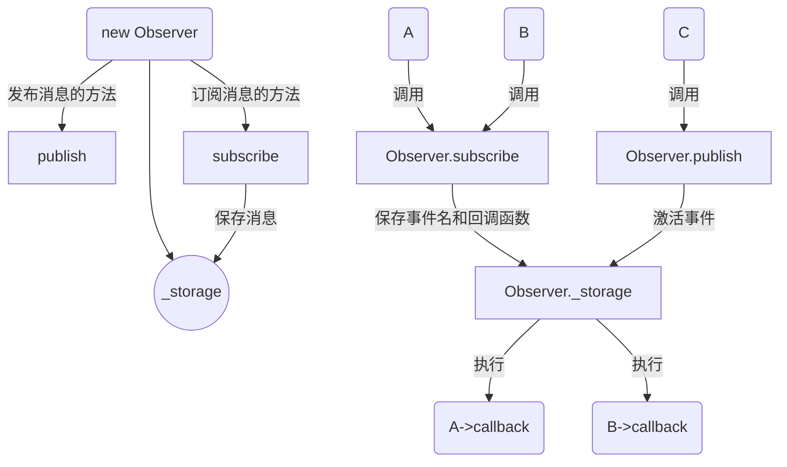

# 设计模式 (Design Patterns)

### 观察者模式 (Observer Pattern)

又叫发布订阅模式（Publish-Subscribe Pattern），这里的核心对象“观察者”是一个充当消息中枢系统的角色，承担管理、分发消息的任务。比如说，对象 A 和 B 都向 Observer 订阅了方法 C 的消息，并存下个人信息（Token、回调函数等，形成消息队列），那么当 C 发布消息时（即执行时），Observer 会通知 A 和 B 并执行其相应的回调函数。这便是观察者模式的过程。

所以我们可以很容易的联想到，JS 中的 “事件” 就是很典型的现成的观察者模式，同样我们也可以使用 `createEvent` 来快速构建观察者模式的实现，当然我们也可以自己实现一个简陋的消息队列。



简易的示例代码：

```js
class IcyObserver {
  constructor() {

    // event line
    this._store = {};
  }

  subscribe(event, callback) {

    // 存放订阅了相同消息的操作的回调函数
    if (this._store[event] instanceof Array) {
      this._store[event].push(callback);
    } else if (!this._store[event]) {
      this._store[event] = [];
      this._store[event].push(callback);
    }
  }

  publish(event, ...args) {
    // 发布一次消息
    try {
      for (let eachCall of this._store[event]) {

        // 遍历消息队列并执行发布消息的对应的已存回调函数
        eachCall(...args);
      }
    } catch (err) {
      console.error(`there is no ${err}`);
      return null;
    }
  }

  cancel(event) {
    
    // 删除某个消息
    try {
      delete this._store[target];
    } catch (err) {
      console.error(`there is no ${event} in store`);
    }
  }
}


// ------ TEST ------ //
let icy = new IcyObserver();

{
  // subscribe 1
  let b = 'b';
  icy.subscribe('right', (e) => {
    console.log(b);  // b
    b = e;
    console.log(b);  // c
  });
  icy.list();
}

{
  // subscribe 2
  let a = 'a';
  icy.subscribe('right', () => {
    console.log(a);  // a
  });
  icy.list();
}

{
  // publish
  icy.publish('right', 'c');
}

{
  // cancel
  icy.cancel('right');
  icy.publish('right'); // ReferenceError
}
// ------ TEST END ------ //
```