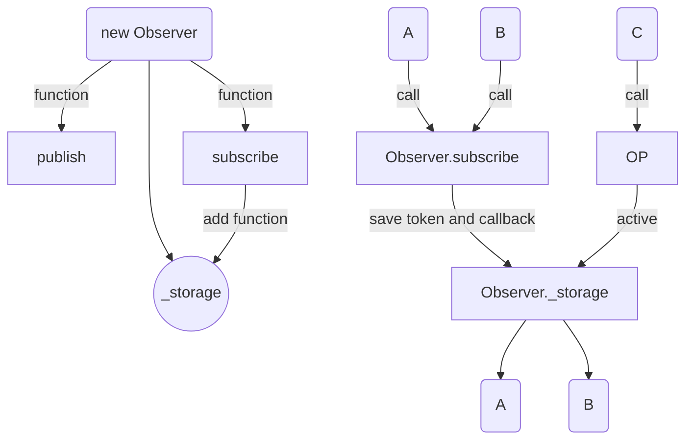

# 设计模式 (Design Patterns)

### 观察者模式 (Observer Pattern)

又叫发布订阅模式（Publish-Subscribe Pattern），这里的核心对象“观察者”是一个充当消息中枢系统的角色，承担管理、分发消息的任务。比如说，对象 A 和 B 都向 Observer 订阅了方法 C 的消息，并存下个人信息（Token、回调函数等），那么当 C 发布消息时（即执行时），Observer 会通知 A 和 B 并执行其相应的回调函数。这便是观察者模式的过程。

