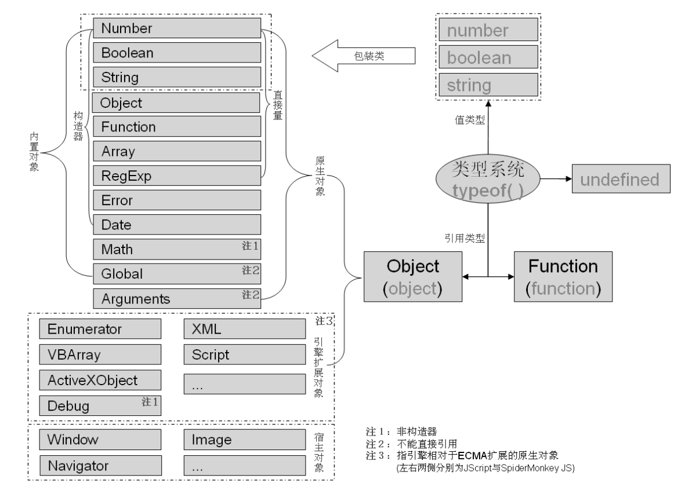

# JavaScript 学习笔记 —— 类型



### 七种数据类型（原始类型 + Object）

##### `null`

##### `undefined`

##### `boolean`

##### `number`

使用二进制 64 位浮点数进行保存，因为不支持十进制浮点数，所以 `.3 - .2 != .1`

##### `string`

immutable，不可变

所有字符串方法都是返回新的字符串，原字符串不变。你可以当做只读数组。

##### `symbol`

##### `object`


### 引用类型

都属于 Object 类型，类比其他 OOP 语言的内置类库，但这里叫构造函数更好吧。

##### `Boolean`

##### `Number`

##### `String`

##### `Array`

##### `Date`

##### `RegExp`

##### `Function`

##### `Set`

##### `Map`

[更多引用类型](https://developer.mozilla.org/zh-CN/docs/Web/JavaScript/Reference/Global_Objects)

### 只读

`window`，`NaN`，`Infinity`，`undefined`

（注意 `null` 是值，不是变量，不能进行 LHS 操作，`undefined` 既是值又是全局只读变量）


### 动态类型转换

> `==` 与 `===` 虽然都是比较两边是否相等，但是 `==` 会在比较时按一定的规则将两边的不同类型先转化为相同的类型再进行比较[^1]，而 `===` 是严格等于，不会转化。同时，在进行对象间的比较时，`==` 和 `===` 都是比较等号两边是否为同一个引用，而非比较属性、方法、值等是否一模一样。

```js

+''              // 0
-''              // -0
-+0              // -0
+-0              // -0

-0 === 0         // true
1 / -0 == 1 / 0  // false  -Infinity != Infinity

1 + ''           // "1"
1 + +''          // 1

1 + '2'          // "12"
1 + +'2'         // 3

12 + '0' - 1     // 119

+'c'             // NaN
1 + 'c'          // "1c"
-'c'             // NaN
1 - 'c'          // NaN
typeof NaN       // "number"

~true            // -2
~false           // -1
~~true           // 1
~~false          // 0
~1               // -2
~0               // -1

010 + '010'      // 8010 // 因为这里 0 开始的数字表示八进制数

NaN == NaN       // false
NaN === NaN      // false
NaN != NaN       // true

null == undefined  // true
null === undefined // false
null == 0          // false // 注意这里 null == 0 是 false，在 C 语言里 NULL == 0 是 true
null === 0         // false
true == 1          // true  // 这里同 C 语言，但 JS 做的处理不同，是 Number(true) === 1
true === 1         // false
false == 0         // true  // 这里同 C 语言，但 JS 做的处理不同，是 Number(false) === 0
false === 0        // false

// 特例
typeof null          // "object"
typeof document.all  // "undefined"

```

### Reference

[^1]: 4.9.1-相等和不等运算符 "《JavaScript 权威指南（第6版）》"

[^2]: https://developer.mozilla.org/zh-CN/docs/Web/JavaScript/Data_structures "JavaScript 数据类型和数据结构"
[^3]: http://es-discourse.com/t/why-typeof-is-no-longer-safe/15 "Why `typeof` is no longer ''safe''?"