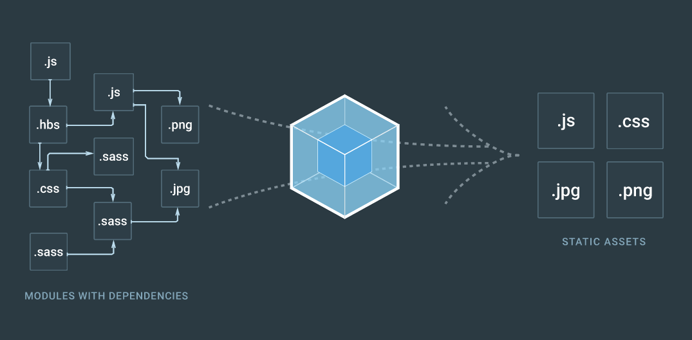

# 前端工程化自动化工具

### Webpack

首先要说明的一点是，webpack 不是一个完整的前端构建工具，这一点 [webpack 官网](https://webpack.js.org/)

一开始就有明：

> At its core, webpack is a module bundler for modern JavaScript applications. When webpack processes your application, it recursively builds a dependency graph that includes every module your application needs, then packages all of those modules into one or more bundles.

我们可以看到，webpack 是一个模块打包的解决方案，可以解决模块化开发过程中的各种依赖关系，webpack 工作时首先会分析入口文件（entry）及其依赖和依赖的依赖（请自行脑补递归），可以将所有资源和代码文本都看成模块，然后通过不同的加载器（loaders）进行处理（resolve），明确依赖关系后进行打包工作，输出一个或多个打包文件（output），所以非模块化开发的项目各种资源和文件没有明确依赖关系，用 webpack 是没有效果的。

只不过 webpack 有自己的一套插件系统，也有诸如热加载、清理文件夹等功能，所以有时候只用 webpack 就够了。然而，webpack 是基于配置的工具，所有功能几乎都要用配置来启用，逻辑性低，容易产生不知所云的错误。

webpack 的配置方法[官网](https://webpack.js.org/)上已经说得十分详尽了，这里我也写了一个简单的 demo，分开了生产环境（production）和开发环境（development）。

简单示例请见：https://github.com/icyzeroice/webpack-demo

### Gulp

gulp 官网：https://gulpjs.com
简单示例请见：https://github.com/icyzeroice/gulp-demo

### 其他 (暂时仅作列举，未实际使用过)

##### Grunt

##### Browserify